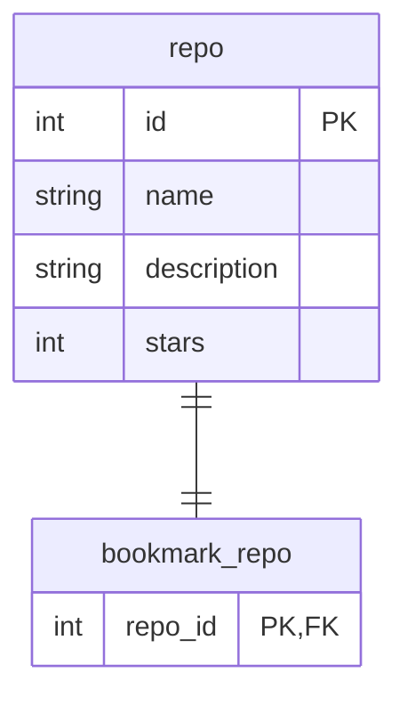

# 概要

株式会社 MIXI の 2025 年新卒向け Android 研修で使用するリポジトリです。
研修では、Kotlin や Android アプリの開発経験がなくても学習できるように、基本的な内容から解説しています。
研修の後半では演習も用意しています。演習では簡易なアプリを作成します。

# 開発環境

- Kotlin 2.1.20
- Android Studio Meerkat Patch 1

# はじめに

Android とは、Google が開発している Linux ベースの携帯端末向け OS です。ソースコードは AOSP（Android Open Source Project）として一般公開されており、各スマホメーカーはこれをベースに独自のカスタマイズを加えた OS を提供しています。

Android アプリとは、Android OS 上で動作するアプリケーションです。Android OS は Java VM のような仮想マシンを搭載しており、アプリはその仮想マシン上で実行されます。

ユーザーは Google Play などのストアから Android アプリをインストールして利用できます（もしくは、デバイスにプリインストールされています）。スマートフォンやタブレットはもちろん、TV（Android TV）、車載システム（Android Auto）やウェアラブル端末（Wear OS）など、幅広いデバイスで動作します。

Android アプリは、いまや様々なプログラミング言語で開発することができます。その中でも下記の理由から Kotlin が注目を浴びています。

- Google が 2019 年に Kotlin を Android 開発の推奨言語として位置づけ、API やドキュメントの整備を積極的に進めることを公式に発表した（[公式資料](https://developer.android.com/kotlin/first)）
- 古いアプリで主に使われていた Java と互換性を保ちつつ、よりシンプルに記述でき、生産性高く開発できる
- マルチプラットフォーム対応が進んでおり、Android と iOS で共通のコードを活用できる

また、開発環境としては、Kotlin との親和性や利便性の高さから、多くのプロジェクトで Android Studio を利用されています。

そのため、この研修でも Kotlin x Android Studio を使ったアプリ開発手法について解説します。

# Kotlin について

Kotlin は、JetBrains 社によって開発された静的型付けのプログラミング言語です。オープンソースとして[GitHub](https://github.com/JetBrains/kotlin)で公開されています。Java プログラムとの相互運用性を保ちながら、可読性が高く簡潔にプログラミングできるため、多くの開発者に利用されています。

## Kotlin の基礎知識

ブラウザ上で Kotlin コードを実行できる Web サイトがあるので、実際にコードを動かしながら学習していきましょう。

https://play.kotlinlang.org/

### main 関数

多くのプログラミング言語と同様に、`main`関数がプログラムが最初に実行されます。`fun`は予約語で、関数を宣言するときにつけます。`println`は引数で受け取った文字列を標準出力に表示する関数です。標準ライブラリに含まれています。

```kotlin
fun main() {
    println("Hello, world!") // Hello, world!と出力される
}
```

### 変数

変数宣言時には`var`か`val`をつけます。`var`にすると後から変更可能にでき、`val`は後から変更不可能にできます。また、初期値を設定すると型推論により型を省略できます。

```kotlin
fun main() {
    var firstName: String
    firstName = "mike" // varなので値を代入できる

    val lastName = "robert"
    lastName = "robert" // valなので代入できずコンパイルエラーになる
}
```

### 関数

引数を受け取る関数を定義したい時には、`引数名: 型名`を`()`の中に記述すれば良いです。その後ろに戻り値を書きます。`,`で区切れば複数の引数を受け取ることができます。

```kotlin
fun add(a: Int, b: Int, c: Int): Int {
    return a + b + c
}
```

単一の式のみが含まれる関数は以下のように `{}` を省略して記述できます。その場合、戻り値の型は型推論されるので省略できます。

```kotlin
fun add(a: Int, b: Int, c: Int) = a + b + c
```

関数の呼び出し時には、引数名もつけて引数に渡せます。

```kotlin
fun add(a: Int, b: Int, c: Int) = a + b + c

fun main() {
    println(add(1, 2, 3))
    println(add(a = 1, b = 2, c = 3)) // これでもOK
}
```

引数にはデフォルト値を設定できます。

```kotlin
fun add(a: Int, b: Int, c: Int = 0) = a + b + c

fun main() {
    println(add(a = 1, b = 2)) // cはデフォルト値があるので省略できる
}
```

### if 式

条件分岐は`if`を使って書くことができます。Kotlin では`if`は式なので、値を返すことができます（そのためか、Kotlin には三項演算子がありません）。

```kotlin
fun main() {
    val num = 10
    println(if (num % 2 == 0) "even" else "odd") // even もしくは odd が表示される
}
```

### クラス

クラスの宣言には`class`という予約語とクラス名が必要です。プロパティは`{}`の中で宣言することができます。デフォルトは`public`で、外部からアクセスできます。外部に公開したくないプロパティは`private`をつけます。クラス名に続けて`()`の中に引数を記述すれば、初期化時に引数を受け取ることができます。

```kotlin
class Contact(val name: String, private val email: String) {
    var tag: String = ""
}

fun main() {
    val c = Contact(name = "mike", email = "fake@email.com")
    println(c.name)  // nameはpublicなので外部からアクセスできる
    println(c.email) // emailはprivateなのでコンパイルエラーになる
    c.tag = "colleague"
    println(c.tag)
}
```

インスタンスに紐づくメソッドは、プロパティと同様にクラスの宣言時に宣言します。

```kotlin
class Cat(val name: String) {
    fun speak() {
        println("$name: meow meow")
    }
}

fun main() {
    val cat = Cat("tama")
    cat.speak()
}
```

`companion object`はクラスの静的なメソッドや定数を宣言することができます。インスタンスを生成するファクトリ関数などを宣言するときに使うと便利です。

```kotlin
enum class HttpStatus(
    val code: Int,
) {
    OK(200),
    NOT_FOUND(404),
    INTERNAL_ERROR(500),
    ;

    companion object {
        fun fromCode(code: Int) = if (code == 200) {
            OK
        } else if (code == 404) {
            NOT_FOUND
        } else if (code == 500) {
            INTERNAL_ERROR
        } else {
            throw IllegalArgumentException()
        }
    }
}

fun main() {
    val status = HttpStatus.fromCode(123) // 不明なコードなのでIllegalArgumentExceptionが発生する
}
```

### when 式

複数パターンの分岐がある時は`when`式を使うと簡潔に書けます。他のプログラミング言語での`switch`に相当します。

```diff
     companion object {
-        fun fromCode(code: Int) = if (code == 200) {
-            OK
-        } else if (code == 404) {
-            NOT_FOUND
-        } else if (code == 500) {
-            INTERNAL_ERROR
-        } else {
-            throw IllegalArgumentException()
-        }
+        fun fromCode(code: Int) = when (code) {
+            200 -> OK
+            404 -> NOT_FOUND
+            500 -> INTERNAL_ERROR
+            else -> throw IllegalArgumentException()
+        }
     }
```

型で分岐させることもできます。すべての型を網羅している場合は`else`をつけなくてもコンパイルできます。

```kotlin
enum class HttpStatus(val code: Int) {
    OK(200),
    NOT_FOUND(404),
    INTERNAL_ERROR(500),
}

fun main() {
    val status = HttpStatus.NOT_FOUND

    val message = when (status) {
        HttpStatus.OK -> "Success"
        HttpStatus.NOT_FOUND -> "Not Found"
        HttpStatus.INTERNAL_ERROR -> "Server Error"
    }

    println(message)
}
```

`when`式ではなるべく`else`はつけない方が良いです。`HttpStatus`に値を追加して分岐を追加し忘れてもコンパイルが通ってしまいます。ミスを防ぐためにも`else`をつけずに全パターン網羅することを意識しましょう！

### データクラス

データをクラスで表現したいときは`data class`を使うと便利です。全部は解説しませんが、`data class`は以下のメソッドを自動生成してくれます。

- `equals()`/`hashCode()`
- `toString()`
- `componentN()` [](https://kotlinlang.org/docs/destructuring-declarations.html)
- `copy()`

```kotlin
data class User(val name: String, val age: Int)
```

Kotlin ではデータの定義に`class`を使った場合、`equals`メソッドを自分で実装しないとデータ同士の比較が意図した挙動になりません。例えば、上記の`User`データで考えたときに`name`と`age`が同じなら、インスタンスが別々でもデータとしては等価なはずなので`==`で比較したときに`true`を返却して欲しいです。しかし、自分で実装しなければ`false`が返却されます。

いちいち自分で実装するのは面倒なので、データの定義には`data class`がよく使われます。

```kotlin
data class UserDataClass(val name: String, val age: Int)

class UserClass(val name: String, val age: Int)

fun main() {
    // classで定義したUserデータ。falseが返却される
    println(UserClass(name = "mike", age = 35) == UserClass(name = "mike", age = 35))

    // data classで定義したUserデータ。trueが返却される
    println(UserDataClass(name = "mike", age = 35) == UserDataClass(name = "mike", age = 35))
}
```

### 拡張関数

拡張関数は、既存のクラスに継承せずとも関数を追加できます。

```kotlin
fun Int.isEven() = this % 2 == 0

fun main() {
    val number = 10
    println(number.isEven())
}
```

### Null 安全

Java とは異なり、型で`null`になり得るかどうかを区別することができます。これにより、不要な null チェックを省略できたり、null なオブジェクトを誤って参照してしまうことで発生する実行時エラー（`NullPointerException`）を回避できます。

nullable な変数を宣言したい場合、型の後ろに`?`をつければ良いです。

```kotlin
fun main() {
    var name: String?
    name = null
}
```

null なオブジェクトは not-null なオブジェクトのように`.`だけではメソッド呼び出しができないようになっています。

```kotlin
fun main() {
    var firstName: String?
    firstName = null

    // コンパイルエラーになる
    println(firstName.length)
}
```

`?`をつければオブジェクトが`null`以外のときのみ、メソッドを実行します。`null`の場合は、`null`が戻り値として返却されます。null チェックが不要になりシンプルに記述できます。

```kotlin
fun main() {
    var firstName: String?
    firstName = "mike"

    println(firstName?.length)
}
```

他にも、スコープ関数と呼ばれる`let`を使うとスマートに null チェックができます。`firstName`が`null`でなければ、let のブロックに渡した関数が実行されます。`it`には`firstName`が入っています。

```kotlin
fun main() {
    var firstName: String?
    firstName = "mike"

    firstName?.let { println(it) }
}
```

`!!`をつけると nullable なオブジェクトを not-null なものとして扱うことができます。ただ、そのオブジェクトが`null`の場合は`NullPointerException`という例外が投げられます。よっぽどな理由がない限り、利用は避けるのが良いでしょう。

```kotlin
fun main() {
    var firstName: String?
    firstName = null

    // firstNameはnullなので実行時エラーになる
    println(firstName!!.length)
}
```

### 関数型とクロージャ

関数を受け取れる関数を宣言することができます。Unit は戻り値を返さないことを表す型です。Java や C の void に相当します。

```kotlin
fun call(number: Int, onCall: (Int) -> Unit) {
    onCall(number)
}

fun main() {
    val onCall: (Int) -> Unit = { number -> println(number) }

    call(
        number = 12,
        onCall = onCall,
    )
}
```

onCall は宣言しなくても直接引数に渡せます。

```diff
 }

 fun main() {
-    val onCall: (Int) -> Unit = { number -> println(number) }
-
     call(
         number = 12,
-        onCall = onCall,
+        onCall = { number -> println(number) },
     )
 }
```

渡している関数の引数が 1 つの場合、引数名を省略して`it`でアクセスできます。

```diff
 fun main() {
     call(
         number = 12,
-        onCall = { number -> println(number) },
+        onCall = { println(it) },
     )
 }
```

また、関数を受け取る引数が最後の場合は、渡す関数を引数の外に出すことができさらに簡潔に書けます。

```diff
 fun main() {
-    call(
-        number = 12,
-        onCall = { println(it) },
-    )
+    call(number = 12) {
+        println(it)
+    }
 }
```

引数として渡している関数のスコープを超えて変数にアクセスすることができます。

```kotlin
fun call(number: Int, onCall: (Int) -> Unit) {
    onCall(number)
}

fun main() {
    var c = 0

    call(number = 12) {
        c = it + 1
    }

    println(c) // 13
}
```

## 演習

サンプルコードを Kotlin Playground で実行してみましょう。

余裕があれば公式ドキュメントを眺めて、気になる機能を調べてみましょう。

https://kotlinlang.org/docs/home.html

# Android Studio について

Android Studio は IntelliJ IDEA ベースの IDE です。Android アプリ開発に特化しています。

操作に慣れるために、プロジェクトを作成してアプリを実行してみましょう！

## アプリを実行する

プロジェクトを作成してアプリを実行してみましょう。まずは Android Studio を https://developer.android.com/studio からインストールして起動してください。

初めて起動すると初期設定のウィザードが表示されるかもしれません。Next を何回かクリックしてツールの DL をしてください。完了したら Finish をクリックしてください。

次に New Project で新規にプロジェクトを作成します。


Empty Activity を選択して Next をクリックします。


アプリ名などを入力します。ここで入力した情報は後からでも変更可能です。

- Name
  - ユーザーから見えるアプリの名前
- Package name
  - Java のパッケージ名のように、ドメインの逆順で命名します
    - 例：mitene.us であれば us.mitene など
- Minimum SDK
  - サポートする最低 OS バージョンです。設定したバージョン未満の OS を利用しているユーザーは、Google Play 上でアプリを見つけられなくなります。
  - Android のバージョンは呼び方が 3 種類あります。例えば、Android 15 だと下記の通りです。OS バージョンによって処理を変えたい時に、コードネームや API レベルを使うことがあるので知っておくと良いです。他のバージョンは[公式資料](https://developer.android.com/guide/topics/manifest/uses-sdk-element#ApiLevels)に記載があります。
    - バージョン : Android 15
    - API レベル : 35
    - バージョンコード : VanillaIceCream


Finish を押すと自動でプロジェクトを開きます。しばらくは indexing など IDE 側の処理が走るので少し待ちます。


完了したらこんな感じの画面になります。


早速エミュレータにアプリをインストールしてみましょう。Android の実機をお持ちの方は実機にもインストールできます。

### エミュレータの場合

まずはエミュレータを作成します。Device Manager をクリックします。


Create Virtual Device をクリックします。


エミュレートする端末を選択します。


Finish をクリックします。システムイメージの DL が始まった場合は完了するまで待ちます。


### 実機の場合

まずは、開発者モードを有効にします。設定アプリを開き、デバイス情報を確認できる画面に遷移してください。ビルド番号を 7 回タップすると有効にできます。

|                                                                                           |                                                                                           |
| ----------------------------------------------------------------------------------------- | ----------------------------------------------------------------------------------------- |
|  |  |

**USB で接続する**

USB をお持ちの方は PC と実機を接続してください。接続できると以下のように接続したデバイス情報が表示されると思います。


**Wi-Fi で接続する**

Wi-Fi で接続する場合は、青矢印の部分をクリックします。


二次元コードが表示されるので、設定アプリの開発者オプションから実機で読み取ってください。

|                                                                                                         |                                                                                                         |
| ------------------------------------------------------------------------------------------------------- | ------------------------------------------------------------------------------------------------------- |
|  |  |

接続が完了したので、ビルドしてアプリをインストールしてみましょう。インストール先のデバイスを選択し、ビルド対象は app モジュールを選択します。緑色の ▶️ をクリックするとビルドからインストールまで自動で行ってくれます。Ctrl + R でも実行できます。


デバイスの画面にテキストが表示されれば OK です。

# アプリ開発演習

この章では、Github にある mixigroup のリポジトリを取得し、ブックマークできるアプリを作成します。

https://github.com/user-attachments/assets/5f80fea3-961a-4b8c-a3a8-2cf5e368044e

演習ではアプリを完成させるまでの道のりをステップに分けています。

- [Step 0 : Jetpack Compose の基本について学習する](#step-0--jetpack-compose-の基本について学習する)
- [Step 1 : リポジトリを表示する](#step-1--リポジトリを表示する)
- [Step 2 : リストでリポジトリを表示する](#step-2--リストで複数のリポジトリを表示する)
- [Step 3 : 画面のタイトルを表示する](#step-3-画面のタイトルを表示する)
- [Step 4 : サーバーからリポジトリを取得する](#step-4--サーバーからリポジトリを取得する)
- [Step 5 : アプリアーキテクチャの導入](#step-5--アプリアーキテクチャの導入)
- [Step 6 : ブックマーク機能を作る](#step-6--ブックマーク機能を作る)
- [Step 7 : データを端末内に永続化する](#step-7--データを端末内に永続化する)
- [Step 8 : ブックマーク画面への遷移処理を実装する](#step--8--ブックマーク画面への遷移処理を実装する)
- [Step 9 : 単体テストを書いてみる](#step-9--単体テストを書いてみる)
- [Step 10 : iOS アプリとコードを共有する](#step-10--ios-アプリとコードを共有する)

各ステップで学習する量はなるべく大きすぎないように設計しています。必要な情報は都度解説をつけています。ステップの最後には演習パートを用意しています。ぜひ自分でもコードを書いて Android アプリ開発を体験してみてください！

## Step 0 : Jetpack Compose の基本について学習する

今回の演習では、Jetpack Compose（以下、Compose）を使ったモダンな方法で UI を実装していきます。まずは Compose について学習しましょう。

### Compose について

Compose とは、Google が開発している UI ツールキットです。2021 年に安定版がリリースされました。従来の実装方法（以下、Android View）と比較して、Kotlin だけでシンプルに UI を記述することができます。

**Android View vs Compose**

単にテキストを表示する実装で比較してみます。

<table>
<tr>
<td>

Android View

```xml
<TextView
    android:id="@+id/text"
    android:layout_width="match_parent"
    android:layout_height="match_parent">
</TextView>
```

```kotlin
val view = findViewById<TextView>(R.id.text)
view.text = "Hello World!"
```

</td>
<td valign="top">

Compose

```kotlin
Text(text = "Hello World!")
```

</td>
</tr>

</table>

Android View では、xml ファイルに表示したいコンポーネントやレイアウトを書きます。データを反映するには Java や Kotlin で、View オブジェクトを操作する必要があります。

一方で、Compose では Kotlin だけで実装できます。View オブジェクトのような UI の状態をプログラマが操作する必要はありません。単に関数を呼び出すだけで UI を記述できます。表示するデータの変更を UI に反映するには、関数に渡している引数を変更するだけで良いです。

### Composable 関数

Compose では関数を呼び出すだけで UI を記述できます。しかし、ただ普通の関数ではダメです。Composable 関数という特別な関数にする必要があります。

**Composable 関数の宣言**

基本的には普通の関数と同じように宣言ができます。ただし、`@Composable`というアノテーションをつける必要があります。

UI を記述する Composable 関数の命名はパスカルケースで名詞にし、戻り値は`Unit`であるべきとされています（[公式ガイドライン](https://github.com/androidx/androidx/blob/androidx-main/compose/docs/compose-api-guidelines.md#naming-unit-composable-functions-as-entities)）。引数には`Modifier`という振る舞いの定義や見た目を装飾するオブジェクトを渡せるようにして、外部から変更できるようにすると再利用しやすいです。

```kotlin
@Composable
fun NameLabel(
    name: String,
    modifier: Modifier = Modifier,
) {
    Text(
        text = name,
        modifier = modifier,
    )
}
```

**Composable 関数の呼び出し**

Composable 関数は Composable 関数の中でしか呼び出すことができません。

```kotlin
// ok
@Composable
fun Composable() {
    NameLabel("mike")
}

// @Composableがないのでコンパイルエラーになる
fun NotComposable() {
    NameLabel("nick")
}
```

実際のアプリでは`Activity`の`onCreate`で`setContent`という関数を使って、Composable 関数を呼び出せるようにします。

※ Activity : View をホストするコンテナのようなオブジェクト
※ onCreate : Activity のライフサイクルに応じて呼び出されるコールバックの一種。画面を開いた時に呼び出される、ぐらいの認識で OK

```kotlin
class HogeActivity : ComponentActivity() {
    override fun onCreate(savedInstanceState: Bundle?) {
        super.onCreate(savedInstanceState)
        setContent {
            // Composable関数をここで呼び出せる
            NameLabel("ika")
        }
    }
}

// setContentの定義
public fun ComponentActivity.setContent(
    parent: CompositionContext? = null,
    content: @Composable () -> Unit // Composable関数の関数型を渡せるようになっている
)
```

**Composable 関数の再実行**

データの変更を UI に反映するには、Composable 関数を再度実行する必要があります。これを Recompose と呼びます。ただし、自分で関数を呼び出す必要はありません。Compose 自身が Recompose を引き起こすべきか判断して、自動的に再実行してくれます。

引数を`Hello, World!`から`Bye!`に変更すると自動的に反映されるイメージです

<table>
<tr>
<td>

```kotlin
Text(text = "Hello, World!")
```

</td>
<td>


</td>
</tr>

<tr>
<td>

```kotlin
Text(text = "Bye!")
```

</td>
<td>


</td>
</tr>
</table>

しかし、ただのオブジェクトを変更しても Compose は変更を検知してくれません。`State型`もしくは`MutableState型`にすることで、Compose がよしなに変更を検知してくれます。

例として、ボタンがクリックされた回数を表示する Composable 関数の実装を見てみます。

```kotlin
@Composable
fun CountButton() {
    var count by remember { mutableIntStateOf(0) }
    Button(
        onClick = { count++ }
    ) {
        Text("count: $count")
    }
}
```

- `mutableIntStateOf`
  - `mutableIntStateOf`は変更可能な`Int型`の value を保持する`MutableState型`を生成します
  - `0`は初期値です
- `remember`
  - Recompose により関数が再実行されても、値を記憶させる関数です。これがないと、再実行のたびに`count`が`0`で初期化されてしまい、クリックされた回数をカウントできません。
- `by`
  - Kotlin の delegated properties（委譲）という言語機能です。これをつけておくと、`MutableState型`を`Int型`のように扱えます。

以上の 3 つを使って、クリックされた状態を管理する`count`という変数を生成します。これをボタンがタップされたら実行されるコールバックの`onClick`で更新します。Compose は`MutableState型`の`count`の変更を検知し、Recompose により再実行します。そのときには`Text`に渡している文字列が更新されているので、クリックされた回数を表示することができます。

### Modifier

Composable 関数で作成した UI の振る舞いや見た目を装飾するオブジェクトです。例えば、タップできるようにしたり、背景色を変更したりできます。

```kotlin
@Composable
fun ClickableText(
    modifier: Modifier = Modifier,
) {
    var count by remember { mutableIntStateOf(0) }

    Text(
        modifier = modifier
            .clickable { count++ }
            .background(color = Color.Gray),
        text = "$count times clicked",
    )
}
```

https://github.com/user-attachments/assets/14d0bb84-2904-492e-ab6a-2159c42c716e

### **プレビュー機能**

Composable 関数で作成した UI は、デバイスにインストールしなくてもサクッとプレビュー機能で確認できます。

プレビュー機能を使うには、プレビュー用の Composable 関数を作成します。普通の Composable 関数に`@Preview`というアノテーションを付与すれば良いです。プレビュー用の関数は公開しなくても UI を確認できるので`private`にします。また、命名は`{プレビューで表示したいComposable関数}Preview`という命名がよく使われます。デフォルトだと背景が透過されみづらいので、`showBackground`を`true`にして背景を白くしています。

```kotlin
@Composable
fun CountButton() {
    var count by remember { mutableIntStateOf(0) }
    Button(
        onClick = { count++ }
    ) {
        Text("count: $count")
    }
}

@Preview(showBackground = true)
@Composable
fun CountButtonPreview() {
    CountButton()
}
```

では、プレビューを表示してみましょう。右上の Split をクリックすれば右側に表示されます。


プレビューは差分を検知して自動で更新してくれます。`Text`に渡している文字列を変更してみてください。プレビューにも自動で反映されたと思います。

また、`Interactive Mode`にすると動的な部分もプレビューでチェックできます。

<table>
<tr>
<td>


</td>
<td>

https://github.com/user-attachments/assets/cf2fb00a-73a8-43c6-bae2-29bda4c0e58e

</td>
</tr>
</table>

## Step 1 : リポジトリを表示する

このステップでは、以下の UI を表示する Composable 関数を実装します。


### Compose でレイアウトを組む

Composable 関数をただ並べても、同じ場所に表示されてしまい UI が重なってしまいます。

<table>
<tr>
<td>

```kotlin
Text("hello")
Text("world")
```

</td>
<td>


</td>
</tr>
</table>

Compose で UI を並べるには`Column`、`Row`、`Box`を使えば良いです。

**`Column`**

- 垂直方向に並べたいときに使います

<table>
<tr>
<td>

```kotlin
Column {
    Square(color = Color.Red, size = 50.dp)
    Square(color = Color.Blue, size = 25.dp)
}
```

</td>
<td>


</td>
</tr>
</table>

- 並べ方を調整したい時は、`Arrangement`や`Alignment`を設定すると良いです

<table>
<tr>
<td>

```kotlin
Column(
    verticalArrangement = Arrangement.spacedBy(4.dp),
    horizontalAlignment = Alignment.End,
) {
    Square(color = Color.Red, size = 50.dp)
    Square(color = Color.Blue, size = 25.dp)
}
```

</td>
<td>


</td>
</tr>
</table>

**`Row`**

- 水平方向に並べたいときに使います

<table>
<tr>
<td>

```kotlin
Row {
    Square(color = Color.Red, size = 50.dp)
    Square(color = Color.Blue, size = 25.dp)
}
```

</td>
<td>


</td>
</tr>
</table>

- `Column`と同様に並べ方を調整したい時は、`Arrangement`や`Alignment`を設定すると良いです

<table>
<tr>
<td>

```kotlin
Row(
    horizontalArrangement = Arrangement.spacedBy(4.dp),
    verticalAlignment = Alignment.CenterVertically,
) {
    Square(color = Color.Red, size = 50.dp)
    Square(color = Color.Blue, size = 25.dp)
}
```

</td>
<td>


</td>
</tr>
</table>

`Box`

- 重ねて並べたいときに使います

<table>
<tr>
<td>

```kotlin
Box {
    Square(color = Color.Red, size = 50.dp)
    Square(color = Color.Blue, size = 25.dp)
}
```

</td>
<td>


</td>
</tr>
</table>

- `Box`は`Aligment`で重ねる位置を調整できます

<table>
<tr>
<td>

```kotlin
Box(
    contentAlignment = Alignment.CenterEnd,
) {
    Square(color = Color.Red, size = 50.dp)
    Square(color = Color.Blue, size = 25.dp)
}
```

</td>
<td>


</td>
</tr>
</table>

### **演習**

早速リポジトリの情報を表示できるようにしましょう。プレビューで確認できれば ok です。その責務を担うコンポーネントは`RepoListItem`として定義することにします。

```kotlin
// I/F
@Composable
fun RepoListItem(
    repo: Repo,
    modifier: Modifier = Modifier,
)
```

`Repo`は表示するリポジトリの情報を表現するクラスです。`Repo`には以下の情報を含ませています。

- リポジトリの ID
- リポジトリ名
- 概要
- スター数

概要が設定されていないリポジトリも存在するので、nullable にしています。

```kotlin
data class Repo(
    val id: Int,
    val name: String,
    val description: String? = null,
    val stars: Int,
)
```

### Tips

- コードが赤文字になりエラーが表示された場合は、import が足りてません。Opt + Enter を押せば候補を出してくれるので、適当に選択します。選択した import を自動で追加してくれます

  - ものによっては大量に候補が出てきますが、大体は@Composable がついているものを選択すれば大丈夫なはずです


<details>

<summary>解説</summary>

概要は nullable なので、null チェックをしてからテキストを表示しましょう。if 文でのチェックでも良いですが、スコープ関数の`let`を使って Kotlin らしく書くことができます。テキストのフォントの太さは`FontWeight`で調整できます。

```diff
 fun RepoListItem(
     repo: Repo,
     modifier: Modifier = Modifier,
-)
+) {
+    Text(
+        text = repo.name,
+        fontWeight = FontWeight.Bold,
+    )
+    repo.description?.let { Text(text = it) }
+}
```

プレビューで確認すると、テキストが重なって表示されてしまいます。`Column`を使って縦に並べましょう。

```diff
     repo: Repo,
     modifier: Modifier = Modifier,
 ) {
-    Text(
-        text = repo.name,
-        fontWeight = FontWeight.Bold,
-    )
-    repo.description?.let { Text(text = it) }
+    Column {
+        Text(
+            text = repo.name,
+            fontWeight = FontWeight.Bold,
+        )
+        repo.description?.let { Text(text = it) }
+    }
 }

```

次にアイコンを表示してみましょう。Material Design の一部のアイコンが Icons で取得できるようになっています。アイコンの色を変えるには`tint`に`Color`を設定してください。 `contentDescription`にセットした文字列は、Talkback という Android のスクリーンリーダー機能で読み上げられます。

詳しくは https://developer.android.com/develop/ui/compose/accessibility/key-steps を参照してください。

```diff
     Column {
         Text(
              text = repo.name,
              fontWeight = FontWeight.Bold,
         )
         repo.description?.let { Text(text = it) }
+        Icon(
+            imageVector = Icons.Outlined.Star,
+            tint = Color.LightGray,
+            contentDescription = null,
+        )
     }
 }
```

スターアイコンの右隣にスター数を表示したいので、`Icon`と`Text`を`Row`で囲います。

```diff
     Column {
         Text(
              text = repo.name,
              fontWeight = FontWeight.Bold,
         )
         repo.description?.let { Text(text = it) }
-        Icon(
-            imageVector = Icons.Outlined.Star,
-            tint = Color.LightGray,
-            contentDescription = null,
-        )
+        Row {
+            Icon(
+                imageVector = Icons.Outlined.Star,
+                tint = Color.LightGray,
+                contentDescription = null,
+            )
+            Text(text = "${repo.stars}")
+        }
     }
 }
```

最後に余白を`Modifier`で設定します。また、`Column`内の余白は`verticalArrangement`で入れます。`Column`や`Row`でのアイテム間の余白の入れ方は他にも各アイテムの`Modifier`で設定する方法と、`Spacer`という Composable 関数で設定する方法がありますが、私個人としては下記の方法が好みです。理由としては、コードがスッキリして見通しが良くなるのと、アイテムを削除するときに意図せず余白が残ってしまうのを防げるためです。

```diff
     repo: Repo,
     modifier: Modifier = Modifier,
 ) {
-    Column {
+    Column(
+        modifier = modifier.padding(8.dp),
+        verticalArrangement = Arrangement.spacedBy(4.dp),
+    ) {
         Text(
             text = repo.name,
             fontWeight = FontWeight.Bold,
```

実装例の差分は以下を参考にしてみてください。
https://github.com/mixigroup/2025BeginnerTrainingAndroid/compare/main...reference/step-1

</details>

### テクニック

プレビューは複数定義できるので、概要がない場合の UI もプレビューで表示できるようにしたいです。もう一つプレビュー用の Composable 関数を追加しても良いですが、プレビューで確認したい状態が増える度に追加するのも少し面倒です。そんな時は`PreviewParameterProvider`を使うと楽にできます。

```kotlin
class RepoPreviewParameterProvider: PreviewParameterProvider<Repo> {
    override val values = sequenceOf(
        Repo(
            id = 1,
            name = "hoge",
            stars = 123,
        ),
        Repo(
            id = 2,
            name = "foo",
            description = "This is awesome repository.",
            stars = 1234,
        ),
    )
}
```

さっき追加したプレビュー用の関数で、`PreviewParameter`を受け取りましょう。概要がない状態の UI もプレビューで表示できているはずです。

```kotlin
@Preview(showBackground = true)
@Composable
private fun RepoListItemPreview(
    @PreviewParameter(RepoPreviewParameterProvider::class) repo: Repo,
) {
    RepoListItem(repo = repo)
}
```

## Step 2 : リストで複数のリポジトリを表示する

次にリポジトリをリストで表示できるようにしてみましょう。


リポジトリを一覧できる画面をホーム画面と呼ぶことにします。まずは、ホーム画面の UI を記述する Composable 関数を作成します。よく使われる命名としては`{画面名}Screen`です。今回は`HomeScreen`という命名で作成します。

では、複数のリポジトリをリストで表示してみましょう。`Column`の中で for 文などで繰り返し`RepoListItem`を呼び出せば、リスト形式で表示できます。

```kotlin
@Composable
fun HomeScreen(
    repos: List<Repo>,
    modifier: Modifier = Modifier,
) {
    Column(modifier = modifier) {
        repos.forEach {
            RepoListItem(repo = it)
        }
    }
}
```

しかし、この方法で大量のリポジトリを表示する場合、パフォーマンスが著しく劣化します。例えば 10000 個のリポジトリを表示するとどうでしょう（※ IDE が非常に重くなるので皆さんは試さなくて大丈夫です）。エミュレータで表示してみると筆者の環境だとメモリが足りずアプリがクラッシュしました。原因は`Column`は画面からはみ出て見えない部分も全て描画しようするからです。

ではどうすれば良いかというと、`LazyColumn`を使うと良いです。`LazyColumn`は見えている部分のみ表示するため、リソースの消費を抑えられます。プレビューやエミュレータで表示してみてください。問題なく表示できると思います。

```kotlin
LazyColumn(modifier = modifier) {
    items(
        items = repos,
        key = { it.id },
    ) {
        RepoListItem(repo = it)
    }
}
```

### **演習**

Step 2 のコードを実装して、プレビューでリポジトリの一覧を表示できることを確認しましょう。

実装例の差分は以下を参考にしてみてください。
https://github.com/mixigroup/2025BeginnerTrainingAndroid/compare/reference/step-1...reference/step-2

## Step 3: 画面のタイトルを表示する

デバイスでリポジトリを表示してみると、OS のステータスバーと被って表示されてしまいました。一般的なアプリは画面の最上部にスペースを開けて、その画面の機能やメニューなどを表示できるようにテキストやアイコンを表示しているでしょう。Compose ではそのようなレイアウトが簡単に実装できるような API が公開されています。それが`Scaffold`です。

表示したい UI を`Scaffold`で囲みましょう。

```kotlin
Scaffold(
    modifier = modifier,
) {
    LazyColumn {
        items(
            items = uiState.repos,
            key = { it.id },
        ) { repo ->
            RepoListItem(repo = repo)
        }
    }
}
```

次に画面トップにアプリバーを表示できるようにします。

```diff
 Scaffold(
     modifier = modifier,
+    topBar = {
+        TopAppBar(
+            title = {
+                Text("ホーム")
+            }
+        )
+    },
 ) {
```

なんだか良さそうに見えますが、実は最初のリポジトリがアプリバーと被って見えなくなっています。Scaffold では padding を受け取れるので、囲った Composable 関数に padding を渡してオフセットをかけるようにします。

```diff
             }
         )
     },
-) {
-         LazyColumn {
+) { innerPadding ->
+         LazyColumn(
+             modifier = Modifier.padding(innerPadding),
+         ) {
        items(
            items = uiState.repos,
            key = { it.id },
```

### **演習**

Step 3 のコードを実装して、デバイスにリポジトリの一覧を表示できることを確認しましょう。

実装例の差分は以下を参考にしてみてください。
https://github.com/mixigroup/2025BeginnerTrainingAndroid/compare/reference/step-2...reference/step-3

## Step 4 : サーバーからリポジトリを取得する

この章では、実際にネットワーク通信をして Github API からリポジトリを取得する処理を実装していきます。

### API について

https://docs.github.com/en/rest/repos/repos?apiVersion=2022-11-28#list-organization-repositories の API を使って、MIXI GROUP 配下にあるリポジトリを取得します。

**トークンの設定**

Github API は認証がない状態で API を叩きすぎると、制限がかかります。念のため、各自でトークンを発行してください。

https://docs.github.com/ja/authentication/keeping-your-account-and-data-secure/managing-your-personal-access-tokens

発行したトークンをプロジェクトで利用できるようにします。`local.properties`にトークンを追加します。

```kotlin
GITHUB_API_KEY=<発行したトークン>
```

`app`にある`build.gradle.kts`で`local.properties`ファイルを読み込み、`BuildConfig`で取得できるようにします。
※ `BuildConfig` : アプリのビルド時に生成されるオブジェクトです。

```kotlin
android {
    defaultConfig {
        // local.propertiesを読み込む
        val properties =
            properties.apply {
                loadProperties(project.rootProject.file("local.properties").path)
            }

        // BuildConfigに値をセット
        buildConfigField("String", "GITHUB_API_KEY", "\"${properties["GITHUB_API_KEY"]}\"")
    }

    buildFeatures {
        buildConfig = true // BuildConfigを生成するフラグ
        compose = true
    }
}

```

コード上では`BuildConfig`から取得できます。

```kotlin
BuildConfig.GITHUB_API_KEY // これでトークンを取得できる
```

### 非同期処理

通信処理など完了に時間がかかるタスクは、メインスレッドとは別のスレッドで実行するべきです。そのような重たい処理をメインスレッドで行うと画面がフリーズしたようにみえ、ユーザー体験が悪くなります。

Android では、5 秒間メインスレッドがブロックされると ANR（Application Not Responding）が発生します。ANR が発生するアプリ = 品質の低いアプリと評価され、Google Play の内部アルゴリズムによってアプリをユーザーが見つけにくくなってしまいます（[公式資料](https://developer.android.com/topic/performance/vitals/anr#android-vitals)）。ビジネス的にも悪い影響を及ぼすので、なるべく ANR が発生しないようにちゃんと非同期で処理してあげましょう。

https://github.com/user-attachments/assets/df368485-1a28-4cb5-b557-c3068d79b181

### Kotlin Coroutines による非同期処理

Kotlin はコルーチンを使った非同期処理をサポートしています。コルーチンとは、中断・再開ができる軽量のスレッドのようなものです。コルーチンを使うと、同期的な処理と同じような書き方で非同期処理を実装できます。

```kotlin
scope.launch {
    val result = runHeavyTask()
    showResult(result)
}
```

**コルーチンの起動**

コルーチンを起動するには、`CoroutineScope`が必要です。`CoroutineScope`とは、その中で起動したコルーチンを管理するオブジェクトという理解で良いです。コルーチンは紐づいている`CoroutineScope`でしか生存できません。

`CoroutineScope`の作り方はいくつかありますが、今回の研修ではライブラリが用意しているものを使うので説明を省略します。

（詳細を知りたい方は、ドキュメント https://kotlinlang.org/api/kotlinx.coroutines/kotlinx-coroutines-core/kotlinx.coroutines/-coroutine-scope/ などを読んでください。）

`CoroutineScope`に対して`launch`を呼んであげるとコルーチンを起動できます。

**コルーチンの中断・再開**

suspend 関数を使うと自動で呼び出し元のコルーチンを中断（suspend）、再開（resume）ができます。中断している間はスレッドをブロックすることなく、他のコルーチンを実行することができるため、効率よく計算することができます。

suspend 関数とは、普通の関数に`suspend`キーワードが付いた関数です。

```kotlin
suspend fun runHeavyTask()
```

suspend 関数は suspend 関数の中からしか呼び出すことができません。

```kotlin
suspend fun runSuspend() {
    runHeavyTask() // ok
}

fun run() {
    runHeavyTask() // コンパイルエラー
}
```

**コルーチンのキャンセル**

`CoroutineScope`に対して`cancel`を呼ぶと、起動しているコルーチンをキャンセルできます。

```kotlin
scope.launch {
    // 処理の途中でもキャンセルされると、それ以降の処理は実行されない
    val result = runHeavyTask()
    showResult(result)
}

scope.cancel()
```

**スレッドの切り替え**

Android ではメインスレッドから別のスレッドに切り替えて、重たい処理をしたいケースがよくあります。そんな時は、`Dispatchers.IO`を使うと良いです。

```kotlin
scope.launch {
    // メインスレッドで実行される部分
    val result = withContext(Dispatchers.IO) {
        // IOスレッドで実行される部分
        runHeavyTask()
    }
    showResult(result)
}
```

スレッドの切り替えをうっかり忘れてしまうかもしれません。そのようなミスを防ぐために、スレッドを切り替える処理を隠蔽するよう実装することが推奨されています（メインセーフ）。

```kotlin
suspend fun runHeavyTask() = withContext(Dispatchers.IO) {
    // 重たい処理
}
```

### Composable 関数内でコルーチンを起動する

Composable 関数では`LaunchedEffect`を使って、コルーチンを起動することができます。`LaunchedEffect`が recompose された時にコルーチンがキャンセルされ再起動します。つまり、引数に渡している`key1`を変化させて、コルーチンの起動タイミングを制御できます。key を複数受け取れるようにした`LaunchedEffect`も用意されています。

```kotlin
LaunchedEffect(key1 = key) {
    // このコールバックでsuspend関数を呼び出せる
}
```

### HTTP クライアントライブラリの導入

**ライブラリの選定**

Java の API（`HttpsURLConnection`）を使って通信処理を実装することもできますが、実際の現場では HTTP ライブラリを使うことがほとんどだと思います。なので、この研修でもライブラリを使うことにします。

よく使われているライブラリとしては`Retrofit`か`Ktor`があります。今回は後で KMP（Kotlin Multiplatform の略。他プラットフォームとコードを共有する技術のこと）対応をしたいので、`Ktor`を選択します。

**ライブラリの依存関係の管理**

ライブラリの依存関係の管理には Gradle が提供している`Version Catalog`を使います。Gradle とは、Java プロジェクト向けのビルドシステムです。Android Studio ではデフォルトで Gradle を利用しています。

`Version Catalog`では toml ファイルに依存するライブラリを書きます。`libs.versions.toml`というファイルを開いてください。CMD + Shift + O でファイル検索すると良いです。

- [versions]
  - ライブラリのバージョンを変数で定義できるセクションです
  - 定義した変数は以下の libraries と plugins セクションで利用することができます
- [libraries]
  - ライブラリを定義できるセクションです
- [plugins]
  - プラグインを定義できるセクションです

```toml
[versions]
agp = "8.9.0"
composeBom = "2024.09.00"

[libraries]
androidx-compose-bom = { group = "androidx.compose", name = "compose-bom", version.ref = "composeBom" }

[plugins]
android-application = { id = "com.android.application", version.ref = "agp" }
```

`app`配下にある`build.gradle.kts`でどのライブラリを利用するかを宣言すれば、ライブラリを利用できます。

```kotlin
dependencies {
    implementation(platform(libs.androidx.compose.bom))
}
```

plugin の場合は、プロジェクトルートにある`build.gradle.kts`にも宣言しておきます。

```kotlin
// build.gradle.kts
plugins {
    alias(libs.plugins.android.application) apply false
}
```

```kotlin
// app/build.gradle.kts
plugins {
    alias(libs.plugins.android.application)
}
```

### JSON のパース

API からは JSON が返却されます。それをパースして Kotlin のオブジェクトに変換する必要があります。変換処理を丸ごと担ってくれるライブラリがプラグインとして Jetbrains から公開されているので、これを利用します。

使い方は非常に簡単です。まずは、JSON から変換したいクラスに`@Serializable`をつけます。JSON の命名とマッピング先のクラスで命名を変更したいときは、`@SerialName`で変更できます。

```kotlin
@Serializable
data class Item(
    val id: Int,
    @SerialName("is_added") val addedCart: Boolean,
)
```

### 演習

では、実際にネットワーク通信をしてサーバーからリポジトリを取得してみましょう。HTTP クライアントは以下を利用してください。

```kotlin
// HTTPクライアントオブジェクトの生成コストは低くはないので、インスタンスを使いまわせるようグローバル空間で生成しておく
val httpClient = HttpClient(CIO) {
    install(ContentNegotiation) {
        // 不要なJSONは無視したいので、ignoreUnknownKeysをtrueにする
        json(json = Json { ignoreUnknownKeys = true })
    }

    // ヘッダーにアクセストークンをセットしておく
    install(Auth) {
        bearer {
            BearerTokens(accessToken = BuildConfig.GITHUB_API_KEY, refreshToken = null)
        }
    }
}
```

HTTP クライアント（Ktor）は以下のライブラリを導入してください。

- `io.ktor:ktor-client-core`
- `io.ktor:ktor-client-cio`
- `io.ktor:ktor-client-content-negotiation`
- `io.ktor:ktor-serialization-kotlinx-json`
- `io.ktor:ktor-client-auth`
- バージョンは全て`3.1.0`を利用してください

JSON パーサー（kotlin serialization）は以下のプラグインを導入してください。

- `org.jetbrains.kotlin.plugin.serialization`
- バージョンは Kotlin と同じバージョンを利用してください

### Tips

- Version Catalog への追加は Android Studio のサポート機能を使うと楽ができます

  - `app/build.gradle.kts`に導入したいライブラリを直書きします

    ```kotlin
    dependencies {
        implementation("io.ktor:ktor-client-core:3.1.0")
    }
    ```

  - `Replace new library catalog declaration …` をクリックします

  

  - 自動的に toml ファイルへ移行してくれます

- ライブラリの追加などで gradle（ビルドシステムのこと）のスクリプトを修正すると、下記のように通知が表示されます。これが表示されたらとりあえず`Sync Now`をクリックすると良いです。ライブラリの追加やバージョンを変更したなら、該当ライブラリの DL を自動で実行してくれます。

  

<details>

<summary>解説</summary>

まず`Ktor`を導入します。

```toml
# libs.versions.toml
[versions]
ktorClient = "3.1.0"

[libraries]
ktor-client-cio = { module = "io.ktor:ktor-client-cio", version.ref = "ktorClient" }
ktor-client-core = { module = "io.ktor:ktor-client-core", version.ref = "ktorClient" }
ktor-client-content-negotiation = { module = "io.ktor:ktor-client-content-negotiation", version.ref = "ktorClient" }
ktor-serialization-kotlinx-json = { module = "io.ktor:ktor-serialization-kotlinx-json", version.ref = "ktorClient" }
```

次に`app`配下にある`build.gradle.kts`に、toml ファイルに書いたライブラリを書きます。

```kotlin
// app/build.gradle.kts
dependencies {
    ...
    implementation(libs.ktor.client.core)
    implementation(libs.ktor.client.cio)
    implementation(libs.ktor.client.content.negotiation)
    implementation(libs.ktor.serialization.kotlinx.json)
    ...
```

プラグインなので、さっきとは違い`[plugins]`の中に書きます。

```toml
# libs.versions.toml
[plugins]
...
kotlin-serialization = { id = "org.jetbrains.kotlin.plugin.serialization", version.ref = "kotlin" }
```

プロジェクトルートにある`build.gradle.kts`と`app`配下にある両方に plugin を追加します。

```kotlin
// build.gradle.kts
plugins {
    ...
    alias(libs.plugins.kotlin.serialization) apply false
}

// app/build.gradle.kts
plugins {
    ...
    alias(libs.plugins.kotlin.serialization)
}

```

`Repo`クラスを JSON レスポンスから変換できるようにします。JSON をパースしてオブジェクトに変換するには`@Serializable`をつければ OK です。ただし、JSON のキー名は一致させる必要があります。JSON キーがスネークケースなどプロパティ名を一致させるのが難しい場合は、`@SerialName`を使いましょう。

```diff
+@Serializable
 data class Repo(
     val id: Int,
     val name: String,
     val description: String? = null,
-    val stars: Int,
+    @SerialName("stargazers_count") val stars: Int,
 )
```

プレビューではネットワーク通信ができません。なので`HomeScreen`を`MainActivity`で呼び出し、実機で表示できるようにしておきます。また、Android アプリは事前に「このアプリはインターネット通信をします」という宣言をしておかないと、通信できません。この状態でアプリを起動してもクラッシュします。なので、`AndroidManifest.xml`に以下を追記します。

```xml
<uses-permission android:name="android.permission.INTERNET" />

<application
  ...
```

HTTP クライアントを使って`GET`してみます。

get メソッドは suspend 関数のため、呼び出すには Coroutine Scope が必要です。Composable 関数内で Coroutine を起動するには、`LaunchedEffect`を使います。（※ LaunchedEffect はネットワーク処理をするための Composable 関数ではありませんが、まずは通信できることを確認したいので許容します）

```diff
 ) {
+    LaunchedEffect(Unit) {
+        val result: List<Repo> = httpClient.get("https://api.github.com/orgs/mixigroup/repos").body()
+    }
+
     HomeScreen(
         modifier = modifier,
         repos = emptyList(),
```

取得したリポジトリを表示できるようにしましょう。`List<Repo>`を監視して、取得に成功したら更新するようにします。監視するためには State オブジェクトにします。また、remember を使って Recomposition で関数が再実行されても値を記憶させます。

```diff
 fun HomeScreen(
     modifier: Modifier = Modifier,
 ) {
+    var repos = remember { mutableStateListOf<Repo>() }
+
     LaunchedEffect(Unit) {
         val result: List<Repo> = httpClient.get("https://api.github.com/orgs/mixigroup/repos").body()
+        repos.addAll(result)
     }

     HomeScreen(
         modifier = modifier,
-        repos = emptyList(),
+        repos = repos,
     )
 }
```

実装例の差分は以下を参考にしてみてください。
https://github.com/mixigroup/2025BeginnerTrainingAndroid/compare/reference/step-3...reference/step-4

</details>

## Step 5 : アプリアーキテクチャの導入

ここまでで、API からリポジトリを取得して画面に表示できるようになりました。しかし、全ての処理が Composable 関数に実装されており、受け持つ責務が必要以上に大きいように見えます。テストも非常に書きづらいです。そこでアーキテクチャを導入し、処理を適切な単位で分割していくことにします。

### アーキテクチャについて

アーキテクチャについて考える上で特に重要なのが「関心の分離（Separation of Concerns）」です。これは、アプリケーションを構成するコンポーネントを役割ごとに分割することで、各コンポーネントの目的を明確にしプログラムに秩序を持たせるという設計原則です。

例えば、UI の表示と、データの取得や保存といった処理は、それぞれ異なる責務を持つものであり、同じクラスやファイルに混在させない方がコードの見通しが良くなるでしょう。このように処理を適切に分割することで以下のメリットを得られます。

- テストが書きやすくなる
  - UI 層とデータ層を分離することで、それぞれの層に特化した単体テストを書きやすくなります
  - これにより、個々のコンポーネントの振る舞いを独立して検証でき、テストの網羅性と信頼性が向上します。
- 再利用性の向上
  - 複数の機能で共通して利用される処理を切り出すことで、同じ処理を何度も実装する必要がなくなります
  - プログラムの再利用性を高めることで開発効率が向上できます
- 保守性の向上
  - 各層やコンポーネント間の結合度を下げることで、修正や機能追加の影響範囲を狭めることができます
  - これにより、変更に強い柔軟な構造を実現できます。

### Android アプリの推奨アーキテクチャ

Android アプリの公式ドキュメントでは、以下のようなレイヤーがあるアーキテクチャが推奨されています。
https://developer.android.com/topic/architecture

※ ドキュメントでは UI 層と Data 層の間に Domain 層が optional として存在しますが、今回は省略します。


**UI 層**

UI の表示処理を主に担うレイヤーです。UI 層はさらに以下のように分割することが推奨されています。


- **UI Elements**
  - 画面の UI を構成するコンポーネントです。例えば、ボタンやテキストなどです。
  - UI を表示する Composable 関数が当てはまります
- **State Holder**
  - 以下のような責務を担うコンポーネントです
    - UI の状態の保持
    - Data 層から取得したデータを UI の状態に変換
    - UI の状態を UI Elements に伝達
    - UI からのイベント（タップ操作など）のハンドリング
  - ViewModel や Presenter といったクラスが当てはまります
    - [公式資料](https://developer.android.com/topic/architecture/recommendations)でも推奨されているため、研修では ViewModel を使います

具体的には以下のような実装になるイメージです。

まずは、UI の状態を定義します。

```kotlin
data class MainUiState(
    val items: List<String>,
)
```

State Holder である ViewModel では UI の状態を UI State として公開します。

```kotlin
class MainViewModel: ViewModel() {
    var uiState = MutableStateFlow(
        MainUiState(
            items = emptyList(),
        )
    )
        private set
}

```

`Flow`はデータを連続的に送ることができるパイプのようなオブジェクトです。データを送りたい時は`update`メソッドかセッターを呼び出します。

```kotlin
// どちらでもデータを送ることができる
uiState.update { it.copy(items = items) }
uiState.value = MainUiState(items = items)
```

データを受け取るときは`Flow`を`collect`します。Composable 関数で受け取る場合は`collectAsStateWithLifecycle`を呼び出せば良いです。こうすれば UI State が ViewModel 側で更新されるたびに、Composable 関数に値が流れてきます。

```kotlin
val uiState by viewModel.uiState.collectAsStateWithLifecycle()
```

ViewModel の生成は下記のようにします。
※ `androidx.lifecycle:lifecycle-viewmodel-compose` ライブラリの依存を追加する必要があります。

```kotlin
val viewModel: MaianViewModel = ViewModel()
```

**Data 層**

アプリデータの操作やビジネスロジックを含むレイヤーです。Data 層はさらに以下のように分割することが推奨されています。


- Repository
  - データソース（≒ データの保存先）を隠蔽するレイヤーです
  - 関連するビジネスロジックも含む場合があります
- RemoteDataSource
  - リモートにあるデータを操作するレイヤーです
  - サーバーの API を叩く処理などはここに実装します
- LocalDataSource
  - ローカルにあるデータを操作するレイヤーです
  - 端末内にデータを保存する処理などをここに実装します

具体的には以下のような実装になるイメージです。

単体テストしやすくするために、依存するクラスをコンストラクタで受け取るようにします。例えば、Repository では RemoteDataSource と LocalDataSource に依存するので、2 つ受け取っています。

```kotlin
class Repository(
    private val remoteDataSource: RemoteDataSource,
    private val localDataSource: LocalDataSource,
)
```

データの操作には時間がかかります。Repository で公開する API は suspend 関数にして、コルーチン内で呼び出すことを強制させる方が良いでしょう。また、呼び出し元でスレッドを意識させないようにしてあげるとミスを防げます（この考え方をメインセーフと呼びます）。

```kotlin
class Repository(
    private val remoteDataSource: RemoteDataSource,
    private val localDataSource: LocalDataSource,
) {
    // suspend 関数にして、呼び出し元でコルーチンを起動させる
    suspend fun getRepoList(): List<Repo> {
        return remoteDataSource.getRepoList()
    }
}

class RemoteDataSource {
    // withContextを使ってIO処理用のスレッドで実行させる
    suspend fun getRepoList(): List<Repo> = withContext(Dispatchers.IO) {
        return httpClient.get()
    }
}

// ViewModelではスレッドを意識しなくて良い
viewModelScope.launch {
    val repoList = repository.getRepoList()
}
```

### 演習

今まで作ったアプリにアーキテクチャを導入してみましょう

ViewModel ではファクトリを実装して、インスタンスの生成はファクトリに任せるようにします。ファクトリはライブラリで提供されているので以下のように実装します。

```kotlin
class HogeViewModel(private val repository: Repository): ViewModel() {

    companion object {
        // ViewModelProvider.Factoryを使ってファクトリを実装する
        val Factory = object : ViewModelProvider.Factory {
            @Suppress("UNCHECKED_CAST")
            override fun <T : ViewModel> create(modelClass: Class<T>): T {
                return HogeViewModel(
                    repository = Repository(),
                ) as T
            }
        }
    }
}
```

<details>

<summary>解説</summary>

最初に ViewModel を作成することにします。まずは UI State を宣言します。

```kotlin
data class HomeUiState(
    val repos: List<Repo>,
)
```

ViewModel を作成します。一旦、HTTP クライアントを直接使うことを許容します。

```kotlin
class HomeViewModel: ViewModel() {
    var uiState = MutableStateFlow(
        HomeUiState(
            repos = emptyList(),
        )
    )
        private set

    fun onLaunched() {
        viewModelScope.launch {
            val repos: List<Repo> = httpClient.get("https://api.github.com/orgs/mixigroup/repos").body()
            uiState.update {
                it.copy(
                    repos = repos,
                )
            }
        }
    }
}
```

Composable 関数にあるロジックを ViewModel で置き換えていきます。

```kotlin
@Composable
fun HomeScreen(
    modifier: Modifier = Modifier,
) {
    val viewModel: HomeViewModel = koinViewModel()
    val uiState by viewModel.uiState.collectAsStateWithLifecycle()

    LaunchedEffect(Unit) {
        viewModel.onLaunched()
    }

    HomeScreen(
        modifier = modifier,
        uiState = uiState,
    )
}
```

次にネットワーク通信をする処理を Repository と DataSource に分割します。

```kotlin
class GithubRepoRemoteDataSource {
    suspend fun fetchRepoList(): List<Repo> {
        return httpClient.get("https://api.github.com/orgs/mixigroup/repos").body()
    }
}
```

```kotlin
class GithubRepoRepository(
    private val remoteDataSource: GithubRepoRemoteDataSource = GithubRepoRemoteDataSource(),
) {
    suspend fun getRepoList(): List<Repo> {
        return remoteDataSource.fetchRepoList()
    }
}
```

ViewModel で Repository を使います。

```diff
-class HomeViewModel: ViewModel() {
+class HomeViewModel(
+    private val repository: GithubRepoRepository = GithubRepoRepository(),
+): ViewModel() {
     var uiState = MutableStateFlow(
         HomeUiState(
             repos = emptyList(),

     fun onLaunched() {
         viewModelScope.launch {
-            val repos: List<Repo> = httpClient.get("https://api.github.com/orgs/mixigroup/repos").body()
             uiState.update {
                 it.copy(
-                    repos = repos,
+                    repos = repository.getRepoList(),
                 )
             }
         }

```

ファクトリを実装します。

```kotlin
class HomeViewModel(
    private val repository: RepoRepository,
): ViewModel() {
    companion object {
        val Factory = object : ViewModelProvider.Factory {
            @Suppress("UNCHECKED_CAST")
            override fun <T : ViewModel> create(modelClass: Class<T>): T =
                HomeViewModel(
                    repository = RepoRepository(
                        remoteDataSource = RepoRemoteDataSource(),
                    ),
                ) as T
        }
    }
}
```

実装したファクトリを渡して ViewModel を生成するようにします。

```diff
 @Composable
 fun HomeScreen(
     modifier: Modifier = Modifier,
-    viewModel: HomeViewModel = viewModel(),
+    viewModel: HomeViewModel = viewModel(factory = HomeViewModel.Factory),
 ) {
     val uiState by viewModel.uiState.collectAsStateWithLifecycle()
```

実装例の差分は以下を参考にしてみてください。
https://github.com/mixigroup/2025BeginnerTrainingAndroid/compare/reference/step-4...reference/step-5

</details>

## Step 6 : ブックマーク機能を作る

次にブックマーク機能を作ります。まずは永続化は考えないことにします。

### イベントのハンドリング

「ボタンをクリックした」などのユーザー操作によるイベントは、その操作を受けた Composable 関数に流れてきます。

<table>
<tr>
<td>

```kotlin
// クリックされるたびにonClickが呼ばれる
Button(onClick = onClick) {
    Text("ボタン")
}
```

</td>
<td>

# TODO: 動画を貼る

</td>
</tr>
</table>

アプリはユーザーの操作を起点に、API を叩くなど様々なロジックを実行します。そのような処理の実行責任は State Holder が担うべきです。

```kotlin
class ViewModel() {
    // クリックできるComposable関数に渡すリスナー
    fun onClick() {
        // 状態を更新する
        uiState.update { ... }
    }
}
```

リスナーは下記のように渡せます。

```kotlin
// どっちでもリスナーを渡せる
Button(onClick = viewModel::onClick)
Button(onClick = { viewModel.onClick() })
```

### リソースを取り込む

ブックマークのアイコンは、スターアイコンとは違ってライブラリにはありません。依存を追加すれば同じように取り込めますが、今回はアイコンをアプリに取り込むことにします。

アイコンのデータは プロジェクトルートの`asset`に置いてあります（ファイル形式は svg です）。
※ アイコンのデータは https://fonts.google.com/icons を利用しています。

次に Android Studio の Resource Manager を開いてください（赤矢印）。Resource Manager は、アプリ内で使用する画像やアイコンなどを管理する機能です。 +アイコンをクリック（青矢印）して、Import Drawables でアイコンを取り込みましょう（橙矢印）。


ファイルを選択すると下記のように取り込んだアイコンが表示されます。


赤枠はリソースの名前です。コードから呼び出すときはここに設定した名前で`R.drawable.icon_name`のようにアクセスします。

drawable には画像も追加できます。コードでアクセスした時にパッと見で画像用のリソースなのかアイコン用のリソースなのか区別できるように、`ic_`など prefix をつけておくと良いでしょう。

### 演習

ブックマークアイコンをタップすると、タップされた状態を反映するようにしてください。データの永続化は考慮しなくて良いです。

https://github.com/user-attachments/assets/defa3890-2422-4a2f-a227-902a3fe7fd89

<details>

<summary>解説</summary>

`RepoListItem`でブックマークアイコンを表示できるようにします。

```kotlin
@Composable
fun RepoListItem(
    repo: Repo,
    modifier: Modifier = Modifier,
) {
    Row(
        modifier = modifier.padding(8.dp),
        verticalAlignment = Alignment.CenterVertically,
    ) {
        Column(
            modifier = Modifier.weight(1f),
            verticalArrangement = Arrangement.spacedBy(4.dp),
        ) {
            Text(
                text = repo.name,
                fontWeight = FontWeight.Bold,
            )
            repo.description?.let { Text(text = it) }
            Row {
                Icon(
                    imageVector = Icons.Outlined.Star,
                    tint = Color.LightGray,
                    contentDescription = null,
                )
                Text(text = "${repo.stars}")
            }
        }

        IconButton(onClick = {}) {
            Icon(
                painter = painterResource(R.drawable.bookmark),
                contentDescription = null,
            )
        }
    }
}

```

ブックマークアイコンがタップされたらアイコンを切り替えてブックマークされている状態がわかるようにしてみます。UI State を変更して、ブックマークされているリポジトリを`Set`で持たせるようにします。

```diff
 data class HomeUiState(
     val repos: List<Repo>,
+    val bookmarkedRepos: Set<Repo>,
 )
```

次にブックマークアイコンがタップされた時に発火させるコールバックを`HomeViewModel`に実装します。

```kotlin
fun onBookmarkIconClick(repo: Repo) {
    uiState.update {
        val bookmarkedRepos = if (repo in uiState.value.bookmarkedRepos) {
            it.bookmarkedRepos - repo
        } else {
            it.bookmarkedRepos + repo
        }

        it.copy(bookmarkedRepos = bookmarkedRepos)
    }
}
```

`RepoListItem`でコールバックを受け取れるようにします。また、ブックマークされたかどうかの状態も受け取ってアイコンを切り替えるようにします。

```diff
 fun RepoListItem(
     repo: Repo,
     isBookmarked: Boolean,
+    onBookmarkIconClick: (Repo) -> Unit,
     modifier: Modifier = Modifier,
 ) {
     Row(
	     ...
             }
         }

-        IconButton(onClick = {}) {
+        IconButton(onClick = { onBookmarkIconClick(repo) }) {
             Icon(
                 painter = painterResource(
                     if (isBookmarked) R.drawable.bookmark_filled else R.drawable.bookmark
```

```diff
   fun RepoListItem(
         IconButton(onClick = { onBookmarkIconClick(repo) }) {
             Icon(
-                painter = painterResource(R.drawable.bookmark),
+                painter = painterResource(
+                    if (isBookmarked) R.drawable.bookmark_filled else R.drawable.bookmark
+                ),
                 contentDescription = null,
             )
         }
```

`HomeScreen`でクリックリスナーを受け取れるようにします。また、ブックマーク状態を反映するようにします。

```diff
     HomeScreen(
         modifier = modifier,
         uiState = uiState,
+        onBookmarkIconClick = viewModel::onBookmarkIconClick,
     )
 }

 ...

  private fun HomeScreen(
     uiState: HomeUiState,
+    onBookmarkIconClick: (Repo) -> Unit,
     modifier: Modifier = Modifier,
 ) {
     Scaffold(

 ...
              ) { repo ->
                 RepoListItem(
                     repo = repo,
+                    onBookmarkIconClick = onBookmarkIconClick,
+                    isBookmarked = repo in uiState.bookmarkedRepos,
                 )
             }
         }
```

実装例の差分は以下を参考にしてみてください。
https://github.com/mixigroup/2025BeginnerTrainingAndroid/compare/reference/step-5...reference/step-6

</details>

## Step 7 : データを端末内に永続化する

今の状態では、アプリを終了した時にブックマークしたリポジトリの情報が失われてしまいます。データを永続化してアプリを再起動しても、ブックマークしたリポジトリが消去されないようにしてみましょう。

### 永続化の方法

データの永続化方法は大きく分けて 2 つありますが、今回はデータ量がそこそこ多いのとリレーションを貼りたいのでデータベース（Jetpack Room）を使います。

| 保存先       | ライブラリ名      | 使い分け                                                           |
| ------------ | ----------------- | ------------------------------------------------------------------ |
| ファイル     | Jetpack DataStore | 保存するデータが設定などのフラグやデータ量が少ない時に使う         |
| データベース | Jetpack Room      | 保存するデータが大量で部分更新や参照生合性をサポートしたい時に使う |

### Jetpack Room について

Jetpack Room (以下、Room)とは Google が開発している公式の DB ライブラリです。SQLite を抽象化しています。

**依存の追加**

Room を利用するには、以下の依存を追加する必要があります。

- `androidx.room:room-compiler`
- `androidx.room:room-ktx`
- `androidx.room:room-runtime`

また、ライブラリ側でアノテーション（`@Composable`などがアノテーション）をパースする必要があるので KSP（Kotlin Symbol Processing）というプラグインも追加します。

- `com.google.devtools.ksp`

**スキーマの定義**

Room ではテーブルのスキーマを Kotlin のオブジェクトで表現できます。
デフォルトではクラス名がテーブル名になりますが、`@Entity`アノテーションを使って変更できます。

```kotlin
@Entity(
    tableName = "items",
)
data class ItemEntity(
    @PrimaryKey val id: Int, // プライマリキーを指定
    val isAdded: Boolean,
)
```

**DAO の定義**

DAO（Data Access Object） は以下のように定義できます。

※ DAO : データベースにアクセスするためのオブジェクト

```kotlin
@Dao
interface ItemDao {
    @Insert // Insert文を発行するメソッドにできる
    suspend fun insert(item: ItemEntity)

    @Insert
    suspend fun insertAll(vararg item: ItemEntity)

    @Query("SELECT * FROM repo") // 生のクエリをかける
    suspend fun findAll(): List<RepoEntity>

    @Delete
    suspend fun delete()
}
```

**データベースの作成**

DAO インスタンスを生成するデータベースクラスを定義します。

```kotlin
@Database(
    entities = [
        ItemEntity::class, // スキーマオブジェクトを渡す
    ],
    version = 1,
)
abstract class AppDatabase : RoomDatabase() {
    abstract fun itemDao(): ItemDao // DAO を返すメソッドを定義
}
```

**DAO のインスタンス化**

実際に DAO インスタンスを生成するときは以下のようにします。

```kotlin
val appDatabase = Room.databaseBuilder(
                        app, // Application（後述）オブジェクトが必要
                        AppDatabase::class.java,
                        "app_database",
                  ).build()

val dao = appDatabase.repoDao()
```

### ファクトリの実装

DAO のインスタンスを注入するために、簡易的な Factory を実装します。

```kotlin
object LocalDataSourceFactory
```

DAO のインスタンスを作りには、Application オブジェクトが必要です。`Application`オブジェクトはカスタムで定義できる`MyApplication`クラスの`onCreate`で取得することにします。

※ Application オブジェクト : アプリのパッケージ名など全体的な設定が含まれるオブジェクトです
※ `MyApplication` : Application は一番最初にインスタンスが作られます。これを継承して自作の Application クラスを作成できます。初期化処理などが実装される場合が多いです。

```kotlin
object LocalDataSourceFactory {
    private lateinit var appDatabase: AppDatabase

    fun initialize(app: Application) {
        appDatabase =  Room.databaseBuilder(
            app,
            AppDatabase::class.java,
            "app_database",
        ).build()
    }
}
```

```kotlin
class MyApplication: Application() {
    override fun onCreate() {
        super.onCreate()

        LocalDataSourceFactory.initialize(this)
    }
}
```

`MyAppllication` は `AndroidManifest.xml` に登録する必要があります。

### 演習

ブックマークしたリポジトリを永続化できるようにしましょう。

テーブルは以下のような ER 図を満たすようにしてください。



<details>

<summary>解説</summary>

依存を追加します。

```toml
[versions]
room = "2.6.1"
ksp = "2.0.21-1.0.27"

[libraries]
androidx-room-compiler = { module = "androidx.room:room-compiler", version.ref = "room" }
androidx-room-ktx = { module = "androidx.room:room-ktx", version.ref = "room" }
androidx-room-runtime = { module = "androidx.room:room-runtime", version.ref = "room" }

[plugins]
ksp = { id = "com.google.devtools.ksp", version.ref = "ksp" }
```

```kotlin

// build.gradle.kts
plugins {
    alias(libs.plugins.ksp) apply false
}

// app/build.gradle.kts
plugins {
    alias(libs.plugins.ksp)
}

dependencies {
    implementation(libs.androidx.room.runtime)
    ksp(libs.androidx.room.compiler)
    implementation(libs.androidx.room.ktx)
}
```

Room ではスキーマを Kotlin のオブジェクトで表現できます。

```kotlin
@Entity(
    tableName = "repo",
)
data class RepoEntity(
    @PrimaryKey val id: Int,
    val name: String,
    val description: String? = null,
    val stars: Int,
)
```

```kotlin
@Entity(
    tableName = "bookmark_repo",
    primaryKeys = ["repo_id"],
    foreignKeys = [
        ForeignKey(
            entity = RepoEntity::class,
            parentColumns = ["id"],
            childColumns = ["repo_id"],
            onDelete = ForeignKey.CASCADE,
        )
    ]
)
data class BookmarkRepoEntity(
    @ColumnInfo("repo_id") val repoId: Int,
)
```

データベースを定義します。さきほど定義したスキーマオブジェクトを渡します。

```kotlin
@Database(
    entities = [
        RepoEntity::class,
        BookmarkRepoEntity::class,
    ],
    version = 1,
)
abstract class AppDatabase : RoomDatabase() {
    abstract fun repoDao(): RepoDao
}
```

DAO を実装します。

```kotlin
@Dao
interface RepoDao {
    @Query("SELECT * FROM repo")
    suspend fun findAll(): List<RepoEntity>

    @Insert
    suspend fun insertAll(vararg repos: RepoEntity)

    @Insert
    suspend fun insertBookmark(repo: BookmarkRepoEntity)

    @Delete
    suspend fun deleteBookmark(repo: BookmarkRepoEntity)

    @Query("""
        SELECT *
        FROM repo
        WHERE id IN bookmark_repo
    """)
    suspend fun findAllBookmark(): List<RepoEntity>
}
```

DB 用のリポジトリを表すオブジェクト（`RepoEntity`, `BookmarkRepoEntity`）と`Repo`を変換する処理を拡張関数で実装します。

```kotlin
fun RepoEntity.toModel() = Repo(
    id = id,
    name = name,
    description = description,
    stars = stars,
)

fun Repo.toEntity() = RepoEntity(
    id = id,
    name = name,
    description = description,
    stars = stars,
)

fun Repo.toBookmarkEntity() = BookmarkRepoEntity(
    repoId = id,
)
```

`LocalDataSource`を作成します。

```kotlin
class GithubRepoLocalDataSource(
    private val dao: RepoDao,
) {
    suspend fun getRepoList(): List<Repo> = dao.findAll().map { it.toModel() }

    suspend fun saveRepoList(repoList: List<Repo>) {
        dao.insertAll(*repoList.map { it.toEntity() }.toTypedArray())
    }

    suspend fun saveAsBookmark(repo: Repo) {
        dao.insertBookmark(repo.toBookmarkEntity())
    }

    suspend fun saveAsUnBookmark(repo: Repo) {
        dao.deleteBookmark(repo.toBookmarkEntity())
    }

    suspend fun getBookmarkRepoListFlow(): List<Repo> {
        return dao.findAllBookmark().map { it.toModel() }
    }
}
```

Repository を修正します。

```kotlin
class RepoRepository(
    private val localDataSource: RepoLocalDataSource,
    private val remoteDataSource: RepoRemoteDataSource,
) {
    suspend fun getRepoList(): List<Repo> {
        return localDataSource.getRepoList().ifEmpty {
            val repoList = remoteDataSource.getRepoList()
            localDataSource.saveRepoList(repoList)
            repoList
        }
    }

    suspend fun saveAsBookmark(repo: Repo) {
        localDataSource.saveAsBookmark(repo)
    }

    suspend fun saveAsUnBookmark(repo: Repo) {
        localDataSource.saveAsUnBookmark(repo)
    }

    suspend fun getBookmarkedRepoList(): List<Repo> {
        return localDataSource.getBookmarkRepoList()
    }
}
```

`HomeViewModel`のファクトリで`RepoLocalDataSource`のインスタンスを渡すようにします。

```diff
   override fun <T : ViewModel> create(modelClass: Class<T>): T =
       HomeViewModel(
           repository = RepoRepository(
+              localDataSource = LocalDataSourceFactory.createRepoLocalDataSource(),
               remoteDataSource = RepoRemoteDataSource(),
           ),
       ) as T
```

`HomeViewModel` を修正してブックマークしたリポジトリを永続化します。

```kotlin
fun onLaunched() {
    viewModelScope.launch {
        uiState.update {
            it.copy(
                repos = repository.getRepoList(),
                bookmarkedRepos = repository.getBookmarkedRepoList().toSet(),
            )
        }
    }
}

fun onBookmarkIconClick(repo: Repo) {
    viewModelScope.launch {
        uiState.update {
            if (repo in uiState.value.bookmarkedRepos) {
                repository.saveAsUnBookmark(repo)
            } else {
                repository.saveAsBookmark(repo)
            }

            it.copy(bookmarkedRepos = repository.getBookmarkedRepoList().toSet())
        }
    }
}
```

実装例の差分は以下を参考にしてみてください。
https://github.com/mixigroup/2025BeginnerTrainingAndroid/compare/reference/step-6...reference/step-7

</details>

## Step 8: ブックマーク画面への遷移処理を実装する

Compose では Navigation Compose を使って画面遷移を実装できます。ひとまず、空の Composable 関数を`BookmarkScreen`として追加しておきます。

まずは依存を追加します。

```toml
[versions]
navigationCompose = "2.8.9"

[libraries]
androidx-navigation-compose = { module = "androidx.navigation:navigation-compose", version.ref = "navigationCompose" }
```

```kotlin
// app/build.gradle.kts
dependencies {
    implementation(libs.androidx.navigation.compose)
}
```

次に画面下部にボトムバー表示して遷移できるようにします。その責務は`TrainingApp`として別の Composable 関数が担うようにします。

Navigation Compose では遷移先を型で表現できます。

```kotlin
@Serializable
object Home // ホーム画面

@Serializable
object Bookmark // ブックマーク画面
```

次に遷移グラフを定義します。ここで、上記で定義した型と遷移先の Composable 関数の対応関係を定義するイメージです。

```kotlin
@Composable
fun BeginnerTrainingApp(
    modifier: Modifier = Modifier,
) {
    val navController = rememberNavController()

    NavHost(navController = navController, startDestination = Home) {
        // ホーム画面
        composable<Home> {
            HomeScreen()
        }

        // ブックマーク画面
        composable<Bookmark> {
            BookmarkScreen()
        }
    }
}
```

`rememberNavController`は`NavHostController`を記憶し、返却する Composable 関数です。`NavHostController`については詳しく解説しません。`navigate`メソッドを呼べば、`NavHost`で定義した Composable 関数へ遷移できるものという理解で大丈夫です。

```kotlin
// HomeScreenを開く
navController.navigate(Home)
```

`NavigationBarItem`を`NavigationBar`で囲めば良い感じの見た目で遷移バーを実装できます。下記のコードはホーム画面に遷移するアイコンを一つだけ表示します。

```kotlin
NavigationBar(modifier = modifier) {
      NavigationBarItem(
          selected = false,
          onClick = {
              navController.navigate(Home)
          },
          icon = {
              Icon(
                  imageVector = Icons.Outlined.Home,
                  contentDescription = null,
              )
          },
      )
}
```

あとは同様にブックマーク画面に遷移するアイコンを表示します。

```kotlin
data class TopLevelRoute<T : Any>(val route: T, val icon: ImageVector)

val topLevelRoutes = listOf(
    TopLevelRoute(Home, Icons.Outlined.Home),
    TopLevelRoute(Bookmark, Icons.Outlined.FavoriteBorder)
)
```

```kotlin
NavigationBar(modifier = modifier) {
    topLevelRoutes.forEach { route ->
        NavigationBarItem(
            selected = false,
            onClick = {
                navController.navigate(route.route)
            },
            icon = {
                Icon(
                    imageVector = route.icon,
                    contentDescription = null,
                )
            },
        )
    }
}
```

現在表示している画面のアイコンは選択状態にしたいです。`NavController`からルートを取得して、型が一致していたら`selected`を`true`にします。

```diff
+val navBackStackEntry by navController.currentBackStackEntryAsState()
+val currentDestination = navBackStackEntry?.destination
+
 NavigationBar(modifier = modifier) {
     topLevelRoutes.forEach { route ->
         NavigationBarItem(
-            selected = false,
+            selected = currentDestination?.hierarchy?.any { it.hasRoute(route.route::class) } == true,
             onClick = {
                 navController.navigate(route.route)
             },
```

ホームとブックマーク画面を行き来してもスワイプしたらアプリを閉じてアプリ一覧画面に戻すには、バックスタックに積まないようにします。

```diff
         NavigationBarItem(
             selected = currentDestination?.hierarchy?.any { it.hasRoute(route.route::class) } == true,
             onClick = {
-                navController.navigate(route.route)
+                navController.navigate(route.route) {
+                    popUpTo(navController.graph.findStartDestination().id) {
+                        saveState = true
+                    }
+                    launchSingleTop = true
+                    restoreState = true
+                }
             },
             icon = {
                 Icon(
```

アプリ下部に遷移バーを表示したければ、前出した`Scaffold`を使います。`bottomBar`に Composable 関数を渡せばそれを下側に表示できます。

```kotlin
@Composable
fun BeginnerTrainingApp(
    modifier: Modifier = Modifier,
) {
    val navController = rememberNavController()

    Scaffold(
        modifier = modifier,
        bottomBar = {
            BeginnerTrainingNavigationBar(navController)
        },
    ) { innerPadding ->
        NavHost(navController = navController, startDestination = Home) {
            composable<Home> {
                HomeScreen()
            }
            composable<Bookmark> {
                BookmarkScreen()
            }
        }
    }
}
```

### **演習**

- Step 8 の画面遷移処理を実装しましょう
- ブックマーク画面を実装してみましょう。ブックマーク画面ではブックマークされたリポジトリのみを一覧表示してください。

## Step 9 : 単体テストを書いてみる

### Android アプリにおけるテスト

テストの種類はざっくり分けて UI テストと単体テストがあります。

**UI テスト**

- ユーザーに見える部分に注目した統合的なテスト
- テスト実行環境は実機 or エミュレータを使う
- 実際の環境に近い状態でテストできる（デバイステスト）が、安定性と実行速度に難がある

**単体テスト**

- テスト対象が一つのメソッドの小さなテスト
- テスト実行環境は Java 仮想マシン上
- UI テストと比較して高速にテストできる（ローカルテスト）が、プログラムの内部しか検証できない（= テストが通ってたとしても実際のアプリが正しい挙動になるかというとそうではない）

**テストファイルの置き場所**

テストファイルは下記のどちらかにおきます。

UI テストのような実デバイス上で実行したいテストは、赤枠の場所におきます。単体テストのようなローカルで実行したいテストは青枠の場所におきます。


**テストファイルの作り方**

すでにあるファイルと同じ階層に置けば良いです。

もしくは、テスト対象のクラスで Opt + Enter から Create test を選択すればテストファイルを作成してくれます。


Member のところでチェックしたメソッドはファイル作成と同時にテストメソッドを作成してくれます。


実デバイスで実行したい場合は、androidTest を選択してください。ローカルで実行したい場合はそのままで ok です。（以下の説明はすべてローカルテストです。ただデバイステストでも大体一緒です。）


OK を押すとこんな感じでテストファイルが作成されます。

```kotlin
class HomeViewModelTest {
    @Test
    fun onBookmarkIconClick() {
    }
}
```

**テストの実行**

テストクラスの左側に表示されている ▶️ から実行できます。

class の横にある方はそのクラスのすべてのテストを実行します。テストメソッドごとに表示されている方は、紐づいているテストだけを実行できます。

<table>
<tr>
<td>


</td>
<td>


</td>
</tr>
</table>

テストが通ると下記のように詳細が表示されます。


テストが失敗するとこんな感じになります。


### フェイクオブジェクトを使う

例として、HomeViewModel の単体テストを書くことを考えてみましょう。現状の実装だと、テスト実行時に実際に API を叩いてリポジトリを取得してしまいます。このままでは、アクセス先のサーバーが落ちた場合や通信環境が悪い場合にテストが失敗してしまいます。

外部への依存をなくし、テストの信頼性を向上させるためのテクニックとしてテストダブルという考え方があります。今回はその 1 つであるフェイクを使います。

具体的には、Repository を interface にしてテストでは fake の Repository を使うようにします。

```kotlin
interface GithubRepoRepository {
    suspend fun getRepoList(): List<Repo>

    suspend fun saveAsBookmark(repo: Repo)

    suspend fun saveAsUnBookmark(repo: Repo)

    suspend fun getBookmarkedRepoList(): List<Repo>
}
```

実際のコードで使う用の Repository とテスト用に使う Repository を用意します。

```diff
-class RepoRepository(
+class DefaultRepoRepository(
     private val localDataSource: RepoLocalDataSource = LocalDataSourceFactory.createRepoLocalDataSource(),
     private val remoteDataSource: RepoRemoteDataSource = RepoRemoteDataSource(),
-) {
-    suspend fun getRepoList(): List<Repo> {
+) : RepoRepository {
+    override suspend fun getRepoList(): List<Repo> {
         return localDataSource.getRepoList().ifEmpty {
             val repoList = remoteDataSource.fetchRepoList()
             localDataSource.saveRepoList(repoList)
...
         }
     }

-    suspend fun saveAsBookmark(repo: Repo) {
+    override suspend fun saveAsBookmark(repo: Repo) {
         localDataSource.saveAsBookmark(repo)
     }

-    suspend fun saveAsUnBookmark(repo: Repo) {
+    override suspend fun saveAsUnBookmark(repo: Repo) {
         localDataSource.saveAsUnBookmark(repo)
     }

-    suspend fun getBookmarkedRepoList() = localDataSource.getBookmarkRepoList()
+    override suspend fun getBookmarkedRepoList() = localDataSource.getBookmarkRepoList()
 }
```

テストで使う用の Repository です。初期値としてリポジトリを設定できるようにしているのと、実際の挙動に近づけるために delay を入れています。

```kotlin
class FakeRepoRepository(
    private val repos: List<Repo>,
    bookmarkedRepos: List<Repo>,
) : GithubRepoRepository {
    private val _bookmarkedRepos: MutableList<Repo> = bookmarkedRepos.toMutableList()

    override suspend fun getRepoList(): List<Repo> {
        delay(100)
        return repos
    }

    override suspend fun saveAsBookmark(repo: Repo) {
        delay(100)
        _bookmarkedRepos.add(repo)
    }

    override suspend fun saveAsUnBookmark(repo: Repo) {
        delay(100)
        _bookmarkedRepos.remove(repo)
    }

    override suspend fun getBookmarkedRepoList(): List<Repo> {
        delay(100)
        return _bookmarkedRepos
    }
}
```

ViewModel では Repository の interface を受け取るようにして、テストコードでフェイクに差し替えられるようにしましょう。

### 演習

HomeViewModel の単体テストを書いてみましょう。

<details>

<summary>解説</summary>

テストファイルを作成しましょう。

```kotlin
class HomeViewModelTest {}
```

`onLaunched`メソッドのテストを書いてみます。

```kotlin
@Test
fun onLaunchedTest() {
		val repos = listOf(
		        Repo(
		            id = 1,
		            name = "fake repo1",
		            stars = 12,
		        ),
		        Repo(
		            id = 2,
		            description = "this is fake repository",
		            name = "fake repo2",
		            stars = 3,
		        ),
	  )

	  val viewModel = HomeViewModel(
	        repository = FakeGithubRepoRepository(
              repos = repos,
              bookmarkedRepos = emptyList(),
          ),
	  )

	  viewModel.onLaunched()

		assertEquals(
		    HomeUiState(
		        repos = repos,
		        bookmarkedRepos = emptySet(),
		    ),
		    viewModel.uiState.value,
		)
}
```

この時点でテストを実行しても実はエラーになります。エラー文を読むと Dispatchers.Main が見つからないようです。どこで Dispatchers.Main が使われているかというと、viewModelScope の中で使われています。

> Exception in thread "Test worker" java.lang.IllegalStateException: Module with the Main dispatcher had failed to initialize. For tests Dispatchers.setMain from kotlinx-coroutines-test module can be used

ではどうすれば良いかというと、テスト用に Dispatchers.Main を書き換えれば ok です。コルーチンのテストライブラリが必要なので、依存を追加します。

```toml
[versions]
kotlinxCoroutinesTest = "1.10.2"

[libraries]
kotlinx-coroutines-test = { module = "org.jetbrains.kotlinx:kotlinx-coroutines-test", version.ref = "kotlinxCoroutinesTest" }
```

```kotlin
testImplementation(libs.kotlinx.coroutines.test)
```

`Dispatchers.Main`を書き換えます。`@Before`をつけたメソッドはテスト毎に最初に呼ばれます。初期化処理などを書くのに便利です。`@After`はテスト毎に終了時に呼ばれます。リソースの解放などの処理を書くのに便利です。

```kotlin
class HomeViewModelTest {
    @Before
    fun setUp() {
        Dispatchers.setMain(StandardTestDispatcher())
    }

    @After
    fun tearDown() {
        Dispatchers.resetMain()
    }

...
```

とりあえずテストは実行できるようになりました。しかし、意図通りの値が入っておらずテストに失敗しています。原因はフェイクの Repository で`delay`で待っているからです。`delay`が終了するのを待たずにテストが実行されて`assert`で失敗しています。

> Expected :HomeUiState(repos=[Repo(id=1, name=fake repo1, description=null, stars=12), Repo(id=2, name=fake repo2, description=this is fake repository, stars=3)], bookmarkedRepos=[])
> Actual :HomeUiState(repos=[], bookmarkedRepos=[])

どうすれば`delay`の完了を待てるのでしょうか？実は`delay`を良い感じにスキップしてくれるテスト用の API があります。`runTest`です。

```diff
 @Test
-fun onLaunchedTest() {
+fun onLaunchedTest() = runTest {
                val repos = listOf(
                        Repo(
                            id = 1,
```

あとは`assert`の前に時間を進める API を呼んであげれば良いです。

```diff
          )

       viewModel.onLaunched()
+      advanceUntilIdle()

       assertEquals(
          HomeUiState(
              repos = repos,
              bookmarkedRepos = emptySet(),
          ),
          viewModel.uiState.value,
       )
 }
```

これでテストが通るようになったと思います。

実装例の差分は以下を参考にしてみてください。
https://github.com/mixigroup/2025BeginnerTrainingAndroid/compare/reference/step-8...reference/step-9

</details>

## Step 10 : iOS アプリとコードを共有する

### Kotlin Multiplatform

Kotlin Multiplatform（以下、KMP）という技術を使えば、iOS など他のプラットフォームとコードを共有することができます。

共有できる部分は UI 以外のロジックの部分です。後述の Compose Multiplatform を使えば、UI 部分も共有することができます。

KMP は Kotlin を開発している Jetbrains が開発しています。Google も KMP を公式にサポートすることを宣言していて、Google 公式のライブラリの KMP 対応などが進んでいます。

Android と iOS はすでに安定版がリリースされていて、KMP を導入しているアプリが増えてきている印象があります。

https://www.jetbrains.com/help/kotlin-multiplatform-dev/supported-platforms.html#current-platform-stability-levels-for-the-core-kotlin-multiplatform-technology

### Compose Multiplatform

Compose Multiplatform（CMP）を使えば、UI のコードも共有することができます。

Android は安定版がリリースされていますが、iOS はまだベータ版です。

https://www.jetbrains.com/help/kotlin-multiplatform-dev/supported-platforms.html#current-platform-stability-levels-for-compose-multiplatform-ui-framework

### CMP で iOS でも動かせるようにする

**環境構築**

KMP を導入するにはいくつか準備が必要です。まずは Xcode をインストールしてください。

次にシミュレータを用意してください。実機がある方は実機で ok です。

次に KMP 用のプラグインを Android Studio にインストールします。

{Github のリンク}で演習で作成したアプリを CMP 対応しました。時間があれば、iOS でも動作するか確認してみましょう。また、差分を眺めて普通の Android アプリとはどう違うかを調べてみましょう！
